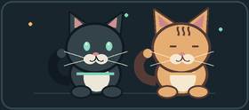
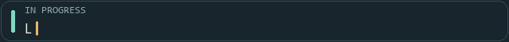

# Hi, I'm DumbDeV-cs

**Learning to code, one small project at a time.**  
Desktop apps · tiny companions · small experiments

*I learn by building, then make each project a little better.*

  

  

## Projects

| Project | What it does |
| --- | --- |
| [Spidey Desktop Companion](https://github.com/DumbDeV-cs/spidey-desktop-companion) | A desktop buddy with pixel-art characters.    |
| [Jurukai](https://github.com/DumbDeV-cs/Jurukai) | An alarm app where completing a mental or physical task turns off the alarm.     |
| [ecommerce-platform](https://github.com/DumbDeV-cs/ecommerce-platform) | A nature-inspired Flutter Web store with catalog browsing, WhatsApp checkout, and an owner admin portal.     |
| [portfolio](https://github.com/DumbDeV-cs/portfolio) | My personal portfolio. |

## Learning & exploring

*Still learning. Still building.*

